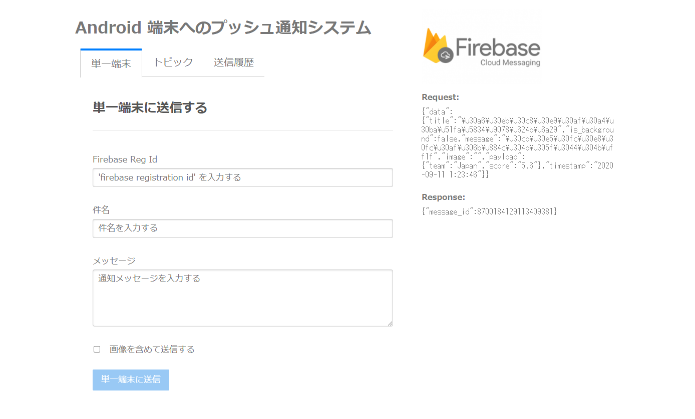
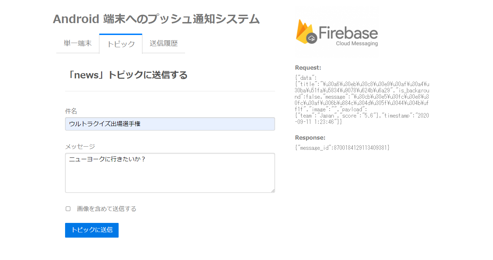
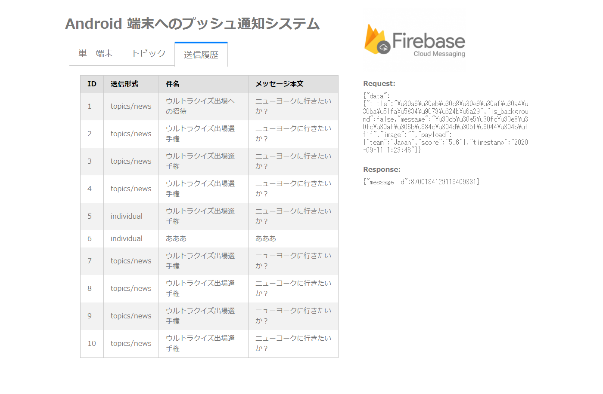

# Firebase を使った Android アプリのプッシュ通知 + PHPによるプッシュ送信の実装

このリポジトリは、サーバ(PHP + MariaDB）の Docker コンテナを含む、プッシュ通知入力・送信システムのサンプルコードです。

サーバーの起動は以下のコマンド：
```console
docker-compose up -d
```

Android 端末側の実装は、別リポジトリにわけている。

Android 端末側の実装：  
https://github.com/fs5013-furi-sutao/android.firebase.notification  

config.php には、サーバ情報を記載する必要があるので、このリポジトリにはコミットしていない。
config.php.example をコピー・リネームして、Firebase プロジェクトのサーバーキー情報を記載する。

以下は、Web アプリの画面。1画面のみの作りだが、タブで 3 つの機能を切り替え表示できるようにしている。

タブ1： 単一端末に送信する


タブ2： 単一端末に送信する


タブ1： 単一端末に送信する


以下は、Firebase の設定をする手順です。

## Firebase
アカウントを作成する。

Firebase
https://firebase.google.com/

## Android新規プロジェクト作成 
AndroidStudioを起動し、EmptyActivityベースで適当なプロジェクトを作成する。

## Firebase 新規プロジェクト作成
Firebaseに戻り、「新規プロジェクトを作成」をクリックし、適当なプロジェクト名と国を選択する。

## Firebaseプロジェクトにアプリ情報の追加
上記で作成したFirebaseプロジェクトに対して、Android アプリを追加する。

パッケージ名は先ほど作成した Android 新規プロジェクトのパッケージ名を、デバッグ用の署名はヘルプボタンをクリックすると確認方法が表示されるので、それを参考に証明書のSHA-1を入力する。

アプリを Firebase に追加する際にデバッグ用の署名証明書が必要なる。証明書は `~/.android/debug.keystore` というファイルに含まれる。

この debug.keystore というファイル自体は Android Studio で Build する際に自動的に作成されるファイル。

以下のコマンドをコマンドプロンプトで実行することで、証明書のフィンガプリントを知ることができる。

```console
keytool -list -v -alias androiddebugkey -keystore %USERPROFILE%\.android\debug.keystore
```

「キーストアのパスワードを入力してください:」とパスワードの入力を求められるが、パスワードを設定したことがなければ、このまま Enter キーを押せば先に進める。

コマンドの実行結果は以下の通り：
```
*****************  WARNING WARNING WARNING  *****************
*キーストアに保存された情報の整合性は*
*検証されていません。整合性を検証するには*
*キーストアのパスワードを入力する必要があります。*
*****************  WARNING WARNING WARNING  *****************

別名: androiddebugkey
作成日: 2020/06/25
エントリ・タイプ: PrivateKeyEntry
証明書チェーンの長さ: 1
証明書[1]:
所有者: C=US, O=Android, CN=Android Debug
発行者: C=US, O=Android, CN=Android Debug
シリアル番号: 1
有効期間の開始日: Thu Jun 25 16:22:03 JST 2020終了日: Sat Jun 18 16:22:03 JST 2050
証明書のフィンガプリント:
         SHA1: 5A:11:FF:7E:64:61:EB:16:51:06:B3:95:4E:6E:84:15:C5:D1:98:FD
         SHA256: 7F:1E:C9:46:01:E1:2A:D7:60:3B:CF:1F:C6:00:AC:74:
                 A4:B5:C5:4F:33:C6:0F:02:C9:04:C2:8E:94:4E:F7:05
署名アルゴリズム名: SHA1withRSA
サブジェクト公開鍵アルゴリズム: 2048ビットRSA鍵
バージョン: 1

Warning:
JKSキーストアは独自の形式を使用しています。
"keytool -importkeystore -srckeystore 
C:\Users\＜ユーザ名＞\.android\debug.keystore -destkeystore
```

このメッセージの中から SHA1　のデータを登録する。
